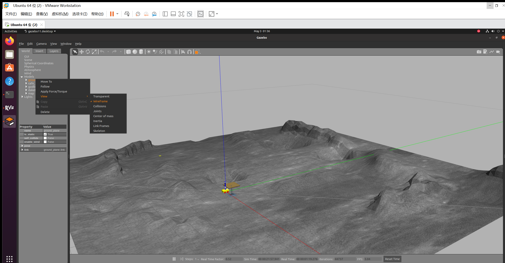

# A Remote-Controlled Robot For Lunar Sampling

-------------------

## Introduction
We have developed a robotic simulation environment for lunar sampling based on the ROS platform. This environment initially includes models of the lunar surface terrain, sampling objects, a lunar sampling car, and a robotic arm. These models are integrated into Gazebo for 3D dynamic simulation. Subsequently, we simulate the automatic sampling process of the rover. The final step involves controlling the rover to move to a designated point and place the sampled objects. The entire sampling experiment is conducted through joint simulation using both rviz and Gazebo. Additionally, we use Blender to create the simulated lunar surface environment.

## Build on ROS
Our testing environment: Ubuntu 20.04
> mkdir -p cakin_ws/src
> cd catkin_ws/src/
> git clone https://github.com/Iris1026/A-Remote-Controlled-Robot-For-Lunar-Sampling.git
> cd  ..
> catkin_make
> echo  "source  /home/XXX/catkin_ws/devel/set up.bash">> ˜ / . bashrc
> source ~/.bashrc

##Insert lunar surface model

Our lunar surface Model:

We have placed the lunar surface model created with Blender in the folder named "surface_model." If you wish to integrate our pre-made lunar surface terrain into Gazebo, you can refer to the link provided. ：[Enter link  here](https://blog.csdn.net/m0_70652514/article/details/131074416?spm=1001.2101.3001.6650.4&utm_medium=distribute.pc_relevant.none-task-blog-2~default~CTRLIST~Rate-4-131074416-blog-124400724.235%5Ev43%5Epc_blog_bottom_relevance_base9&depth_1-utm_source=distribute.pc_relevant.none-task-blog-2~default~CTRLIST~Rate-4-131074416-blog-124400724.235%5Ev43%5Epc_blog_bottom_relevance_base9&utm_relevant_index=9)

If you prefer to customize the terrain, you can download Blender from its official website. [Enter link here](https://www.blender.org/)

## Running

Run launch file to start：
>roslaunch marm_gazebo arm_bringup_moveit.launch

Insert the lunar surface model into Gazebo. 
To clearly observe the lunar surface model, set the ground_plane to wireframe:

Run the automatic grabbing script：
>rosrun function moveit_fk_demo.py

Execute the keyboard control script:
> rosrun teleop_twist_keyboard teleop_twist_keyboard.py

## Results
Automatic grabbing effect：

Controlling the rover to navigate around obstacles：

Successfully reaching the target location：

Controlling the robotic arm joints via rviz：

Successfully placing the sampled objects：

